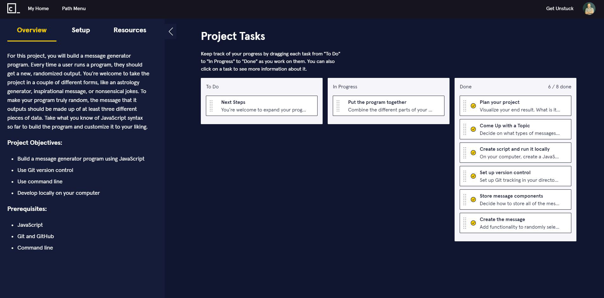

# Mixed Messages

## General Info

Codecademy Project practicing task for Full-Stack Engineer Course

## Description

Project Tasks:

+ Plan
+ Come Up with a Topic
+ Create script and run it locally
+ Set up version control
+ Store message components
+ Create the message
+ Put the program together
+ Next Steps: expand (see: ./src/script.js )

**Context:**

> For this project, you will build a message generator program. Every time a user runs a program, they should get a new, randomized output. You’re welcome to take the project in a couple of different forms, like an astrology generator, inspirational message, or nonsensical jokes. To make your program truly random, the message that it outputs should be made up of at least three different pieces of data. Take what you know of JavaScript syntax so far to build the program and customize it to your liking.

## Screenshots



## Technologies

+ Javascript ES6
+ Git and GitHub
+ Command line

## Setup

To run this project use node.js with command

```
$ node app.js from bin directory
```
or just run it on your code playground (e.g. [jsfiddle](https://jsfiddle.net/))

## Created

2021

## License

[MIT](https://choosealicense.com/licenses/mit/)
